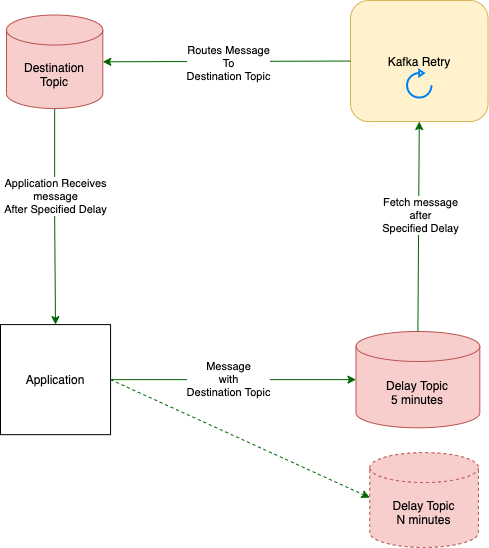

docker run --env-file ./env.list --network host -d kafka-retry_kafka-retry
docker-compose up -d

# Kafka Retry Router
This project provides a microservice application with generic message retry capability for Kafka-based messaging architectures.
The application is implemented in Node.js.

Using Kafka-transactions to maintain the exactly-once semantics within the same Kafka cluster.

### Usage
Can start using docker-compose or docker command. Need to configure environment as required.
```
1. docker run --env-file ./env.list --network host -d kafka-retry_kafka-retry
2. docker-compose up -d
```

### Deployment Topology
Shown below is a simplified deployment topology highlighting the flow between the Kafka Retry application. The consumer application forwards
its failed messages to the retry topics with pre-configured delay, from where the Kafka Retry application consumes the messages and forwards them to the destination topic specified with each message. Consumer application can choose from one of the delay topics with preconfigured delays.

<p align="center">
  
</p>


### Internals
Kafka Retry uses Kafka Transactions internally to provide exactly-once routing semantics.

- Deployment need to have dedicated topics for different delays required.
- Kafka Retry process message from each delay topics after delay associated with the topic.
- Delays are associated with the topics, application need to push message to appropriate delay topics.
- Application needs to specify the `destination topic` with the message, for the message to be routed after the required delay.
- Application needs to specify latest `timestamp` with each message to determine the delay.
- If no valid `final_topic` is found message is routed to the `fallback topic`.
- If no fallback topic is configured message is written to the configured log with log-level `error`.

### Message Headers
Each message produced to the retry topic should have a `final_topic` and `msg_ts`. The following message headers are required:

#### `final_topic`
`final_topic` specifies the destination topic name. Message are routed to `final_topic` after topic's delay.

#### `msg_ts`
`msg_ts` is epoch timestamp in `seconds`. This needs to be associated with each message header.
```
Sample Message using kafkacat:

$ echo '{"foo": "bar"}' | kafkacat -b localhost:9092 -t retry_topic_5sec -P -H msg_ts=`date +%s` -H final_topic=destination_topic
```

### Configuration
Application configuration is controlled via environment variables. Consult the 
[keep.env](./keep.env) file for a complete list. Also can use [env.list](./env.list) with docker command with flag `--env-file`. Deployment need to make the copy of `keep.env` to `.env` with production configuration. Some important variables are listed below:

* `RETRY_QUEUE_CONFIG` - Configures kafka topic names with their respective delays as a key-value pairs separated by `colon`. Multiple such queues can be configured with different delays separated by `semi-colon`.
> Example: Two different queues with delays 300 seconds and 900 seconds.
>```RETRY_QUEUE_CONFIG=retry_topic_5min:300;retry_topic_15min:900```

* `KAFKA_BROKERS_LIST` - List of Kafka brokers separated by `comma`.
* `PRODUCER_TRANSACTION_ID` - Kafka Retry transaction consumer id.
* `CONSUMER_GROUP_NAME` - Kafka consumer group name for the Retry Router. Can instantiate multiple instances with same group name.
* `KAFKA_FALLBACK_TOPIC` - Retry Router routes messages to fallback topic if `final_topic` not found in message header.
* `NODE_ENV` - could be `prod` or `dev`.

##### Syslog Config
* `SYSLOG_HOST`
* `SYSLOG_PORT`
* `SYSLOG_APPNAME`
* `SYSLOG_LOCAL_HOSTNAME`

## Development
Kafka Retry is written in Node.js, using [KafkaJS](https://github.com/tulios/kafkajs) internally.

### Future Improvements
* Provide a pre-built Docker image for deployment.
* More extensible/customizable retry mechanism.